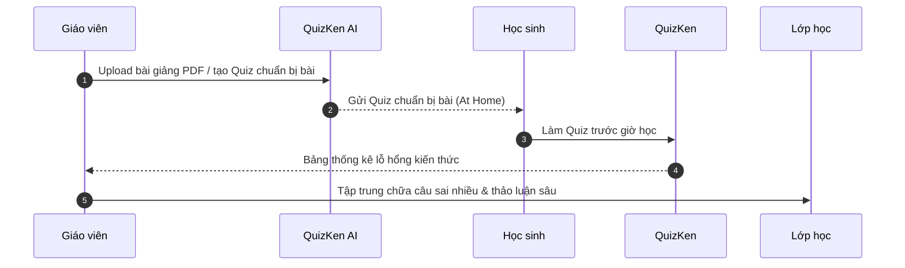

> **Tóm tắt nhanh (TL;DR):** Mô hình **Lớp học đảo ngược (Flipped Classroom)** đang trở thành xu hướng giảng dạy trọng tâm của chương trình GDPT 2018. Thay vì thầy cô giảng lý thuyết trên lớp và giao bài tập về nhà, học sinh sẽ tự nghiên cứu bài học trước ở nhà qua tài liệu/Quiz AI và dùng thời gian trên lớp để thảo luận, làm bài tập nâng cao. Bài viết hướng dẫn giáo viên triển khai mô hình này dễ dàng cùng QuizKen.

---

## 1. Mô Hình Lớp Học Đảo Nước (Flipped Classroom) Là Gì?

Trong lớp học truyền thống, 80% thời gian trên lớp dành cho việc giáo viên đọc-chép hoặc giảng giải lý thuyết cơ bản. Học sinh tiếp thu thụ động và khi về nhà làm bài tập khó thì không có ai hỗ trợ.

**Lớp học đảo ngược (Flipped Classroom)** đảo ngược hoàn toàn quy trình này:

| Giai đoạn | Lớp Học Truyền Thống | Lớp Học Đảo Nước (Flipped) |
| :--- | :--- | :--- |
| **Trước giờ học (At home)** | Chưa chuẩn bị gì hoặc đọc qua SGK. | Xem bài giảng ngắn + Làm bài Quiz AI chẩn đoán trên QuizKen. |
| **Trong giờ học (In class)** | Nghe giáo viên giảng lý thuyết nền tảng. | Thảo luận nhóm, giải quyết bài tập vận dụng cao, phản biện. |
| **Sau giờ học (After class)** | Tự làm bài tập về nhà trong cô đơn. | Ôn luyện từ vựng / công thức qua Flashcard Spaced Repetition. |

---

## 2. Lợi Ích Vượt Trội Của Flipped Classroom Ứng Dụng AI

1. **Học sinh chủ động nắm nhịp học:** Học sinh có thể đọc lại tài liệu nhiều lần ở nhà tùy theo tốc độ tiếp thu cá nhân.
2. **Tiết kiệm 50% thời gian giảng bài:** Giáo viên không cần lặp lại các định nghĩa cơ bản trên lớp.
3. **Phát hiện sớm học sinh chưa hiểu bài:** Nhờ kết quả Quiz làm trước ở nhà, giáo viên biết ngay học sinh nào chưa nắm vững kiến thức trước khi bước vào tiết học.

---

## 3. Quy Trình 3 Bước Triển Khai Lớp Học Đảo Nước Cùng QuizKen

### Bước 1: Tạo bộ Quiz chuẩn bị bài (Pre-class Quiz) trong 30 giây
Giáo viên đưa tài liệu bài mới vào QuizKen AI. AI sẽ tự động sinh ra bộ Quiz 5-10 câu hỏi kiểm tra mức độ Nhận biết và Thông hiểu.

### Bước 2: Giao bài cho học sinh hoàn thành trước giờ học
Học sinh truy cập link QuizKen trên điện thoại hoặc máy tính để làm bài. Kết quả tự động đổ về bảng quản lý của giáo viên.

### Bước 3: Tổ chức tiết học trực tiếp dựa trên dữ liệu thực tế
Khi bước vào lớp, giáo viên mở dashboard QuizKen Analytics:
- Nếu 90% học sinh đã trả lời đúng câu 1-3: Bỏ qua không cần giảng lại.
- Nếu 60% học sinh làm sai câu 4: Giáo viên dành 10 phút đầu giờ tập trung giải thích đúng trọng tâm câu 4.

---

## 4. Bắt Đầu Đổi Mới Phương Pháp Giảng Dạy Ngay Hôm Nay

Mô hình Lớp học đảo ngược kết hợp công nghệ AI không chỉ giúp tiết học trở nên sinh động mà còn giải phóng giáo viên khỏi công việc giảng bài rập khuôn.

> **Trải nghiệm công cụ:** [Tạo bài Quiz chuẩn bị bài Flipped Classroom cùng QuizKen](https://www.quizken.com) hoàn toàn miễn phí!
