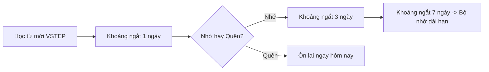

> **Tóm tắt nhanh (TL;DR):** Kỳ thi VSTEP (Vietnamese Standardized Test of English Proficiency) trình độ B1 - B2 là chìa khóa vàng giúp học sinh lớp 12 miễn thi tốt nghiệp môn Tiếng Anh và quy đổi điểm xét tuyển đại học theo chương trình GDPT 2018. Bài viết chia sẻ phương pháp nạp 1.500+ từ vựng VSTEP cốt lõi trong 30 ngày nhờ công nghệ **Flashcard AI** và thuật toán **Spaced Repetition** trên QuizKen.

---

## 1. Tại Sao VSTEP B1-B2 Lại Là "Cơn Sốt" Xét Tuyển 2026?

So với chứng chỉ IELTS (chi phí thi gần 5 triệu đồng và hết hạn sau 2 năm), **bằng VSTEP B1-B2** do các trường đại học tại Việt Nam cấp sở hữu hàng loạt ưu điểm vượt trội:
- **Lệ phí thi hợp lý:** Chỉ từ 1.5 - 1.8 triệu đồng/lượt thi.
- **Giá trị quy đổi cao:** Đạt VSTEP B1 (Bậc 3) hoặc B2 (Bậc 4) được quy đổi tương đương điểm 9 - 10 môn Tiếng Anh xét tuyển đại học tại nhiều trường như ĐHQG Hà Nội, ĐHQG TP.HCM, Bách Khoa, Kinh tế Quốc dân.
- **Bám sát chương trình GDPT 2018:** Cấu trúc bài đọc và chủ đề nói/viết bám sát ngữ liệu kinh tế, xã hội và văn hóa Việt Nam.

---

## 2. Vấn Đề Lớn Nhất Khi Tự Ôn VSTEP: Trôi Từ Vựng

Hầu hết thí sinh thi VSTEP B1-B2 không đạt mục tiêu là do **thiếu vốn từ vựng học thuật (Academic Vocabulary)**. Khi làm phần Reading và Listening, học sinh thường gặp phải các từ thuộc cấp độ B1-B2 nhưng không thể nhớ nghĩa ngay trong áp lực thời gian làm bài.

Phương pháp chép từ ra sổ tay truyền thống khiến bạn quên tới **80% từ vựng** sau 48 giờ (theo đường cong quên thuộc Đường cong Ebbinghaus).

---

## 3. Lộ Trình Ôn Từ Vựng VSTEP 30 Ngày Cùng QuizKen Flashcard AI

Để ghi nhớ từ vựng VSTEP vào bộ nhớ dài hạn, giải pháp tối ưu nhất năm 2026 là kết hợp **Flashcard AI** với thuật toán **Lặp lại ngắt quãng (Spaced Repetition)**.

### Tuần 1: Nạp từ vựng VSTEP B1 (Chủ đề Đời sống & Giáo dục)
- Học 300 từ vựng chủ đề School, Work, Environment, Technology trên bộ thẻ Flashcard QuizKen.
- Tính năng **Phát âm chuẩn IPA** giúp bạn nhớ luôn cả âm tiết để làm tốt phần Listening.

### Tuần 2-3: Nâng cấp vốn từ B2 (Chủ đề Xã hội & Khoa học)
- Ôn luyện 500 từ vựng trình độ B2 (ví dụ: `implement`, `subsequent`, `alleviate`, `predominantly`).
- Mỗi thẻ Flashcard bao gồm: Từ vựng + Phiên âm + Định nghĩa Việt-Anh + Ví dụ ngữ cảnh bài thi VSTEP.

### Tuần 4: Luyện Quiz phản xạ nhanh từ vựng
- Chuyển toàn bộ thẻ Flashcard thành bài Quiz trắc nghiệm điền từ trên QuizKen để luyện phản xạ dưới 5 giây/câu.

---

## 4. Các Tính Năng Nổi Bật Trên QuizKen English Hub Hỗ Trợ VSTEP

1. **AI Auto-Generate Flashcard:** Bạn chỉ cần dán một đoạn văn Reading VSTEP vào, QuizKen AI sẽ tự động trích xuất các từ khó trình độ B1-B2 và tạo bộ Flashcard đẹp mắt trong 5 giây.
2. **Ngân hàng đề thi thử VSTEP Online:** Làm bài thi thử Reading & Listening trên giao diện máy tính y hệt thi thật tại các trung tâm khảo thí.
3. **Theo dõi chỉ số ghi nhớ:** QuizKen hiển thị phần trăm từ vựng bạn đã "nắm chắc" và tự động nhắc nhở ôn lại các từ bạn hay làm sai.

> **Tải bộ từ vựng miễn phí:** Học ngay bộ [1500 Từ Vựng VSTEP B1-B2 Cốt Lõi Trên QuizKen](https://www.quizken.com) để tự tin rinh bằng B2 ngay trong lần thi đầu tiên!
